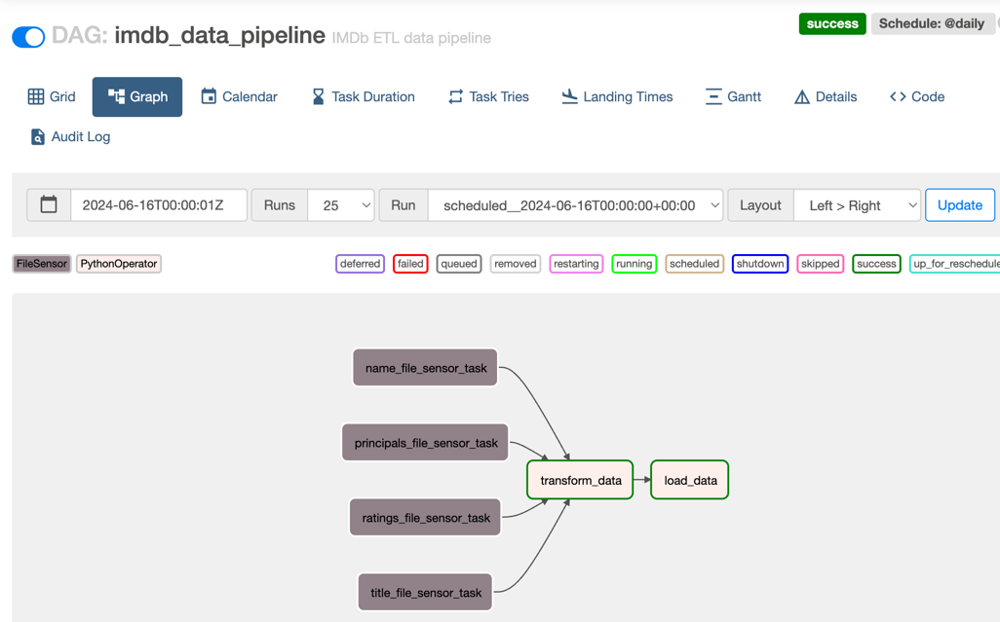

## README: IMDb Data Pipeline with Apache Airflow

### Project Structure
```
airflow/
│
├── dags/
│   └── imdb_data_pipeline.py    # The Airflow DAG definition file
│
├── common/
│   └── etl.py                   # Contains the ETL functions (load_data, transform_data)
│
├── callbacks/
│   └── failure_callbacks.py     # Contains the failure callback function (task_failure_callback)
│
├── data/
│   ├── input/                   # Directory for input data files
│   └── output/                  # Directory for output data files
│
├── Dockerfile                   # Dockerfile for building the Docker image
├── docker-compose.yaml          # Docker Compose file to set up the Airflow environment
├── airflow.sh                   # Script to initialize and start Airflow
└── README.md                    # Project documentation
```
### Prerequisites
***Apache Airflow:*** Ensure Airflow is installed and running.

***Python:*** Ensure Python is installed.

***Docker:*** Ensure Dockerhub is installed in local
    
* [Install Docker Desktop on Windows](https://docs.docker.com/desktop/install/windows-install/)
* [Install Docker Desktop on Mac](https://docs.docker.com/desktop/install/mac-install/)
* [Install Docker Engine on Linux](https://docs.docker.com/desktop/install/linux-install/)


### Installation
```commandline
docker compose up --build
```
### Set Up Airflow Variables

In the Airflow UI, navigate to Admin -> Variables and set the following variables:

***input_path:*** Path to the directory containing the input files.

***output_path:*** Path to the directory where transformed files will be stored.

***db_conn:*** Database connection string (e.g., sqlite:///census.sqlite).


### Airflow DAG: imdb_data_pipeline.py

This Airflow DAG defines the IMDb data pipeline. It consists of the following tasks:


***File Sensor Tasks:*** Check if the required files exist.

***Transform Task:*** Transform the data from TSV to Parquet format.

***Load Task:*** Load the transformed data into a database.


### Running the DAG

**Place Input Files**

Ensure the necessary input files (title.basics.sample.tsv, title.ratings.sample.tsv, title.principals.sample.tsv, name.basics.sample.tsv) are placed in the directory specified by the input_path variable.

#### Initialize Airflow

Run the airflow.sh script to initialize Airflow:

`./airflow.sh`

##### Trigger the DAG

In the Airflow web UI, trigger the *imdb_data_pipeline* DAG to start the ETL process.

### Conclusion

This Airflow DAG and supporting scripts set up a basic ETL pipeline for IMDb data. The pipeline includes sensors to check for input files, tasks to transform the data, and a task to load the data into a database. Additionally, it includes a failure callback to handle task failures and send email 
